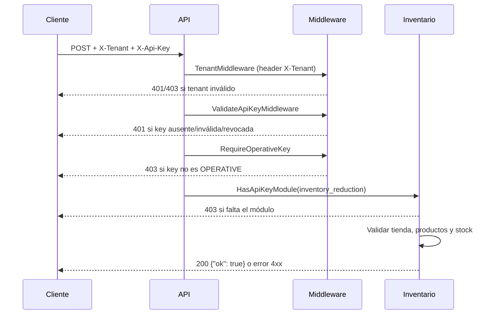

# API de reducción de inventario (integración externa)

Documentación para desarrolladores que integran sistemas externos con Smart Order mediante una **API key operativa** creada en el panel del sistema.

---

## Tabla de contenidos

1. [Introducción](#introducción)
2. [Requisitos previos](#requisitos-previos)
3. [URL base y tenant](#url-base-y-tenant)
4. [Autenticación](#autenticación)
5. [Modelo de autorización](#modelo-de-autorización)
6. [Endpoints](#endpoints)
7. [Identificadores](#identificadores)
8. [Idempotencia](#idempotencia)
9. [Validaciones del servidor](#validaciones-del-servidor)
10. [Códigos de error](#códigos-de-error)
11. [Buenas prácticas](#buenas-prácticas)
12. [Ejemplos completos](#ejemplos-completos)

---

## Introducción

Esta API permite **descontar stock** en la bodega asociada a una tienda autorizada en tu API key. Cada operación registra movimientos con el tipo indicado por ítem (por defecto **Consumo**) y documento `API_INVENTORY_REDUCTION`.

Actualmente existe **un único endpoint**: la reducción se identifica siempre por **código externo del producto** (`external_code`).

La bodega **no se envía en el body**: el servidor la resuelve automáticamente según la configuración de tu API key (emparejamiento tienda ↔ bodega).

---

## Requisitos previos

Antes de llamar a este endpoint, tu organización debe tener:

1. **API key de tipo `OPERATIVE`** (no sirve una key `GENERAL`).
2. El módulo **`inventory_reduction`** asignado a esa key.
3. En la configuración del módulo, al menos un par **tienda + bodega** autorizado (`store_ids` y `warehouse_ids`, emparejados por índice).
4. Productos dados de alta en la tienda (**tienda / productos**) con **código externo** configurado desde el dashboard, y stock en la bodega configurada.
5. `external_id` configurado en las tiendas que uses en la integración.
6. El **tenant** (identificador de tu instancia) para enviarlo en el header `X-Tenant` en cada petición.

La key en texto plano (`rawKey`) **solo se muestra una vez** al crearla en el dashboard. Guárdala de forma segura; no se puede recuperar después.

---

## URL base y tenant

Todas las rutas viven bajo la URL base de la API:

```text
https://api-demo-dev.smart-order.io/api/v1/managed/inventory/...
```

> La URL anterior corresponde al entorno de desarrollo actual (`api-demo-dev.smart-order.io`) y puede cambiar. Verifica siempre la URL vigente con el administrador de tu instancia.

El **tenant** ya **no** se resuelve por subdominio del host. Se resuelve a partir del header **`X-Tenant`**, cuyo valor es el identificador (slug) de tu tenant en Smart Order:


| Header     | Valor                                  |
| ---------- | --------------------------------------- |
| `X-Tenant` | Slug/identificador de tu tenant (ej. `demo-dev`) |


> **Importante:** Toda petición sin el header `X-Tenant` (o con un valor que no corresponde a un tenant existente) falla con `401` y el mensaje *"Tenant no especificado en el header X-Tenant"* o *"Tenant no encontrado"*.

---

## Autenticación

Incluye el tenant y la API key en **cada** petición:


| Header         | Valor                                                |
| -------------- | ---------------------------------------------------- |
| `X-Tenant`     | Slug/identificador de tu tenant                      |
| `X-Api-Key`    | Tu API key completa (texto plano emitido al crearla) |
| `Content-Type` | `application/json`                                   |


### Flujo de validación (orden)




| Condición                              | HTTP  | Mensaje típico                                              |
| -------------------------------------- | ----- | ------------------------------------------------------------ |
| Sin header `X-Tenant`                  | `401` | `Tenant no especificado en el header X-Tenant`                |
| `X-Tenant` no corresponde a un tenant  | `401` | `Tenant no encontrado`                                        |
| Sin header `X-Api-Key`                 | `401` | `Unauthorized`                                               |
| Key inválida, revocada o inexistente   | `401` | `Unauthorized`                                               |
| Key no es `OPERATIVE`                  | `403` | `Esta ruta requiere una API key operativa`                   |
| Key sin módulo `inventory_reduction`   | `403` | `La API key no tiene permiso para reducción de inventario`   |


---

## Modelo de autorización

Al crear o editar la API key en el dashboard, se configuran:

- **`store_ids`**: tiendas autorizadas.
- **`warehouse_ids`**: bodegas asociadas, **en el mismo orden** que `store_ids`.

El servidor empareja por **índice**:

```text
store_ids[0]     ↔ warehouse_ids[0]
store_ids[1]     ↔ warehouse_ids[1]
...
```

Cuando envías `store_id` en el body, el sistema:

1. Resuelve la tienda por `store.external_id`.
2. Comprueba que esa tienda esté en `store_ids` de tu key.
3. Obtiene la bodega en la misma posición del array.
4. Descuenta stock **solo en esa bodega**.

**No envíes `warehouse_id` en el body.** Si la tienda no está autorizada, recibirás `403` con *"La tienda no está autorizada para esta API key"*.

---

## Endpoints

### Resumen


| Método | Ruta                                      | Descripción                          |
| ------ | ----------------------------------------- | ------------------------------------ |
| `POST` | `/api/v1/managed/inventory/reduce-by-sku` | Reducir por código externo           |


### Respuesta exitosa

**HTTP `200 OK`**

```json
{
  "ok": true
}
```

---

### `POST /managed/inventory/reduce-by-sku`

Descuenta inventario identificando cada ítem por **código externo** en la tienda indicada.

#### Body


| Campo                      | Tipo     | Obligatorio | Descripción                                                      |
| -------------------------- | -------- | ----------- | ---------------------------------------------------------------- |
| `store_id`                 | `string` | **Sí**      | ID externo de la tienda (`store.external_id`)                    |
| `reference`                | `string` | **Sí**      | Referencia de idempotencia (ver [Idempotencia](#idempotencia))   |
| `items`                    | `array`  | **Sí**      | Lista de productos a descontar (mínimo 1)                        |
| `items[].external_code`    | `string` | **Sí**      | Código externo del producto en la tienda                         |
| `items[].quantity`         | `number` | **Sí**      | Cantidad a descontar; debe ser `> 0`                             |
| `items[].movement_type`    | `string` | No          | Tipo de movimiento: `"withdrawal"` (Consumo, por defecto), `"sale"` (Venta) o `"waste"` (Merma). Permite clasificar el motivo de la reducción para seguimiento. |

#### Ejemplo de body

```json
{
  "store_id": "TIENDA-CENTRO-01",
  "reference": "venta-pos-2026-05-15-0042",
  "items": [
    { "external_code": "PROD-001", "quantity": 2.5, "movement_type": "sale" },
    { "external_code": "PROD-002", "quantity": 1 }
  ]
}
```

---

## Identificadores

Todos los IDs que envías en el body de este endpoint son **IDs externos** de tu sistema, mapeados en Smart Order:

### Tienda

| Campo      | Origen en Smart Order   | Descripción                          |
| ---------- | ----------------------- | ------------------------------------ |
| `store_id` | `store.external_id`     | Identificador de tienda en tu ERP/POS |

### Producto

| Campo                    | Origen en Smart Order | Descripción                                      |
| ------------------------ | --------------------- | ------------------------------------------------ |
| `items[].external_code`  | `product_per_store.sku` | Código externo del producto en la tienda indicada |

El código externo debe existir en la tienda indicada.

---

## Idempotencia

El campo **`reference`** es **obligatorio** en cada petición. Evita descontar stock dos veces si reenvías la misma operación (timeouts, reintentos de red, etc.).

### Comportamiento

Antes de descontar, el servidor busca un movimiento previo con la misma combinación: `(reference, API_INVENTORY_REDUCTION, api-key:<id>)`.

- Si **ya existe** → **`200` con `{"ok": true}`** sin volver a descontar.
- Si **no existe** → se procesa la reducción y se registra con esa `reference`.

### Alcance de la idempotencia

La clave es única por:

- Valor de `reference`
- Tipo de documento `API_INVENTORY_REDUCTION`
- API key que realiza la operación (`api-key:<uuid>`)

Dos keys distintas **pueden** usar la misma `reference` sin conflicto entre sí.

### Recomendación

Usa `reference` con un ID estable de tu sistema (número de pedido, UUID de transacción, etc.):

```json
{
  "reference": "mi-sistema:orden-12345",
  "store_id": "TIENDA-CENTRO-01",
  "items": [...]
}
```

Si recibes `200` tras un reintento con la misma `reference`, puedes asumir que la reducción ya se aplicó o se aplicó en el intento anterior.

---

## Validaciones del servidor

Además de autenticación y permisos, el servidor valida:


| Validación                                     | Error típico (400)                                                      |
| ---------------------------------------------- | ----------------------------------------------------------------------- |
| `reference` vacío u omitido                    | `400` con `param` `reference` (validación de binding)                   |
| Código externo vacío                           | `código externo vacío en ítems`                                         |
| Cantidad ≤ 0                                   | `La cantidad debe ser mayor a 0 para el código externo ...`              |
| `movement_type` inválido                       | `400` con `param` `movement_type` (validación de binding)               |
| Producto no existe en la tienda                | `El producto con código externo ... no existe en la tienda`              |
| Producto no asignado a la bodega de la key     | `El producto con código externo ... no está asignado a la bodega indicada` |
| Stock insuficiente                             | `Stock insuficiente para el código externo .... Disponible: X, solicitado: Y` |
| `store_id` desconocido                         | `No se encontró tienda con el store_id indicado`                          |
| JSON inválido o campos requeridos faltantes    | `400` con `param` indicando el campo (validación de binding)            |


Los movimientos quedan registrados con:

- **Tipo:** según `movement_type` de cada ítem (`withdrawal` → Consumo por defecto, `sale` → Venta, `waste` → Merma)
- **Tipo de documento:** `API_INVENTORY_REDUCTION`
- **Observación:** incluye el nombre de la API key para trazabilidad

---

## Códigos de error

Las respuestas de error son un **array JSON**:

```json
[
  {
    "message": "Descripción del error",
    "param": "nombre_campo"
  }
]
```

El campo `param` solo aparece en errores de validación de entrada (`RecipeError`, HTTP `400`).

### Tabla de códigos HTTP


| Código | Cuándo                                                                                  |
| ------ | --------------------------------------------------------------------------------------- |
| `200`  | Operación exitosa (o idempotente ya aplicada)                                           |
| `400`  | Body inválido, reglas de negocio de entrada, producto no encontrado, stock insuficiente |
| `401`  | Sin API key, key inválida, tenant no especificado o no encontrado                       |
| `403`  | Key no operativa, sin módulo, tienda no autorizada, tenant inactivo                     |
| `500`  | Error interno (p. ej. fallo al resolver tenant)                                         |


### Mensajes frecuentes (referencia)

**Autenticación / permisos (`401` / `403`)**


| Mensaje                                                           |
| ----------------------------------------------------------------- |
| `Unauthorized`                                                    |
| `Esta ruta requiere una API key operativa`                        |
| `La API key no tiene permiso para reducción de inventario`        |
| `La tienda no está autorizada para esta API key`                  |
| `La API key no tiene tiendas autorizadas`                         |
| `Configuración inválida: número de tiendas y bodegas no coincide` |
| `Tenant no especificado en el header X-Tenant`                    |
| `Tenant no encontrado`                                            |
| `Tenant inactivo`                                                 |


**Validación de body (`400`, con `param` cuando aplica)**


| Mensaje                              | `param`         |
| ------------------------------------ | --------------- |
| `store_id` requerido (binding)       | `store_id`      |
| `reference` requerido (binding)      | `reference`     |
| `external_code` requerido (binding)  | `external_code` |

---

## Buenas prácticas

### Seguridad

- **Nunca** expongas la API key en el frontend ni en repositorios públicos.
- Rota o desactiva keys comprometidas desde el dashboard.
- Usa HTTPS en producción.

### Diseño de integración

1. **Siempre envía `reference`** con un identificador estable de tu operación.
2. **Agrupa ítems en una sola petición** cuando una venta u operación afecta varios productos (menos latencia, un solo documento de referencia).
3. **Usa `external_code`** para identificar productos de forma consistente con tu catálogo.
4. **No asumas el `warehouse_id`**: depende de la configuración de la key; solo controlas la tienda mediante `store_id`.
5. **Mapea tiendas autorizadas** en tu sistema con los `external_id` configurados en Smart Order y asociados a la key.

### Manejo de errores y reintentos


| Situación                                  | Acción                                                                      |
| ------------------------------------------ | --------------------------------------------------------------------------- |
| `401`                                      | Revisar el header `X-Tenant` y la API key. No reintentar sin corregir credenciales. |
| `403`                                      | Revisar tipo de key, módulo y tienda en configuración del dashboard.        |
| `400` stock insuficiente                   | No reintentar con los mismos datos; sincronizar stock o ajustar cantidades. |
| `400` producto no encontrado               | Verificar códigos externos y tienda antes de reintentar.                    |
| `500` / timeout de red                     | Reintentar con la **misma `reference`** para evitar doble descuento.        |
| `200` tras reintento con misma `reference` | Tratar como éxito (idempotencia).                                           |


El servidor reintenta internamente hasta 3 veces ante conflictos de serialización en PostgreSQL; aun así, conviene que tu cliente reintente `5xx` con backoff exponencial.

### Pruebas

1. Crear una API key `OPERATIVE` con módulo `inventory_reduction` y una tienda de prueba.
2. Probar reducción con `reference` fija dos veces → segunda llamada debe devolver `200` sin cambiar stock adicional.
3. Probar tienda no autorizada → `403`.
4. Probar cantidad mayor al stock → `400` con mensaje de stock disponible.
5. Probar petición sin `reference` → `400`.

---

## Ejemplos completos

Sustituye:

- `{TENANT}` → slug/identificador de tu tenant (ej. `mi-empresa`)
- `{API_KEY}` → tu key operativa
- Los IDs externos y códigos por valores reales de tu entorno

> La URL base usada abajo (`https://api-demo-dev.smart-order.io/api/v1`) corresponde al entorno de desarrollo actual y puede cambiar.

### Reducir por código externo

```bash
curl -X POST "https://api-demo-dev.smart-order.io/api/v1/managed/inventory/reduce-by-sku" \
  -H "X-Tenant: {TENANT}" \
  -H "X-Api-Key: {API_KEY}" \
  -H "Content-Type: application/json" \
  -d '{
    "store_id": "SUCURSAL-NORTE",
    "reference": "pos-ticket-10042",
    "items": [
      { "external_code": "BEB-001", "quantity": 2, "movement_type": "sale" },
      { "external_code": "SNK-010", "quantity": 1.5 }
    ]
  }'
```

### Respuesta exitosa

```json
{
  "ok": true
}
```

### Ejemplo de error de validación

**HTTP `400`**

```json
[
  {
    "message": "Key: 'ReduceStockBySkuRecipe.StoreID' Error:Field validation for 'StoreID' failed on the 'required' tag",
    "param": "store_id"
  }
]
```

### Ejemplo de error de permisos

**HTTP `403`**

```json
[
  {
    "message": "La tienda no está autorizada para esta API key"
  }
]
```

---

## Soporte

Para configurar `external_id` en tiendas y el código externo (`external_code`) de cada producto en la pestaña "producto tienda" del dashboard, coordina con el administrador de tu instancia Smart Order o consulta la documentación interna del panel de API keys.
